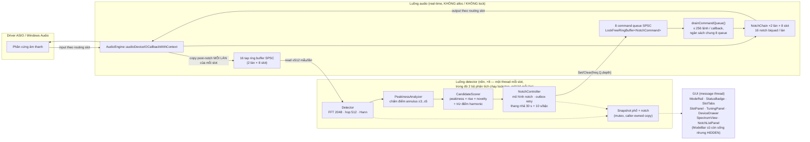
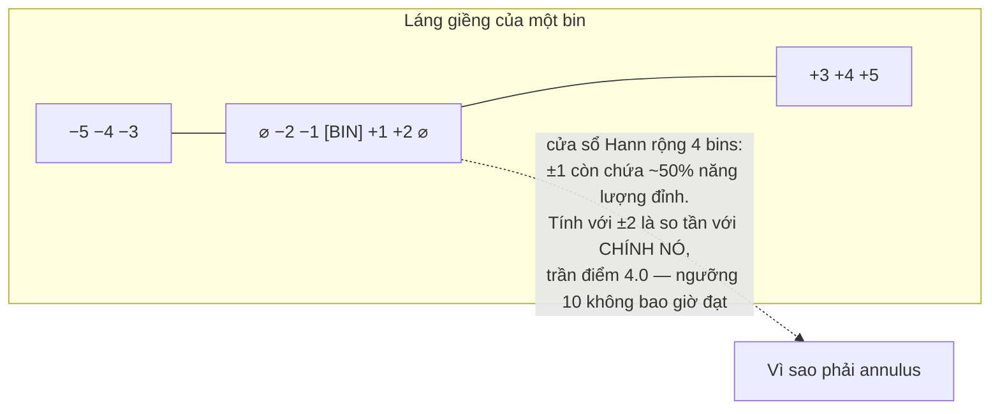

# Kỹ thuật chống hú — AZ Soundtech Hands-free

> Tài liệu mô tả cách hệ thống loại bỏ acoustic feedback, khớp với code
> đang chạy (`src/`) tại thời điểm 07/09/2026, v1.2.0 (đã hiện thực và qua gate
> ctest, **546/546** tại `fba2626`; **chưa đóng gói** — `release-alpha.ps1` sẽ
> chạy sau final review, SHA-256/kích thước cập nhật khi đó; 1.2.0 = lane G,
> thang độ sâu + nhả dần; 1.1.3 = lane R, chip RING RISK). Số liệu lấy trực tiếp từ
> header/khối `constexpr` trong source. Đọc kèm [`GIOI-THIEU.md`](GIOI-THIEU.md).

## 1. Kiến trúc tổng thể — hai luồng, một đường lock-free

Nguyên tắc nền tảng của real-time audio: **luồng audio không bao giờ được chờ
ai**. Mọi allocation, mutex hay I/O trên luồng đó là một cơn dropout tiềm ẩn.
Vì thế hệ thống tách làm hai luồng, trao đổi nhau qua hai kênh lock-free
(SPSC — single-producer single-consumer), và mọi thứ còn lại dùng mutex thoải mái:



Hai chiều bất đối xứng có chủ đích:

| Chiều | Kênh | Vì sao dạng này |
|---|---|---|
| Audio → Detector | 16 tap ring buffer (SPSC, một cái mỗi **làn** của mỗi slot) | Luồng audio chỉ `write()` và **không bao giờ chờ**; ring đầy thì drop và đếm (`getTapDropCount()`) |
| Detector → Audio | 8 command queue (SPSC, một cái mỗi slot) | Luồng audio rút tối đa `kMaxCommandsPerCallback = 256` lệnh mỗi callback — **một ngân sách dùng chung** cho cả 8 queue, không phải 256 mỗi queue; không rút hết cũng chẳng sao — lệnh còn lại chờ kỳ sau |

Mọi dữ liệu GUI cần (phổ, trạng thái notch) đi qua **snapshot có mutex**: luồng
detector không real-time nên chờ được; caller nhận bản copy của riêng mình nên
không có race.

## 2. Đường tín hiệu audio (chu kỳ vài ms)

1. Driver đưa một block vào callback; mỗi slot bật lấy đúng kênh vào/ra nó
   được route.
2. **Bypass mode**: copy thẳng in → out. **Auto/Soundcheck**: mỗi mẫu đi qua
   chuỗi 16 biquad notch của làn nó trong slot.
3. Sau khi xử lý, **mỗi làn sau notch của MỖI slot** được copy một lần vào
   tap ring riêng của làn đó (8 slot × 2 làn = 16 ring) — ở mọi mode, kể cả
   Bypass — detector nghe đúng thứ người nghe được, kể cả khi notch đã cắt.
   Slot mono chỉ ghi làn 0; làn 1 của nó không có ai đọc.
4. Rút command queue (tối đa 256 lệnh, ngân sách dùng chung cho cả 8 queue)
   áp dụng `Set`/`Clear` vào NotchChain.
5. Trả output cho driver. Toàn bộ bước trên: **zero allocation, zero lock**.
   `ScopedNoDenormals` bật ở đầu callback — sau ~4 giây im lặng tuyệt đối,
   chuỗi biquad không có nó sẽ rơi vào limit-cycle denormal và CPU vọt từ
   1.7 ms/s lên 94 ms/s (đã đo, xem ledger CRITICAL 1).

### Bộ lọc notch và độ sâu

Không phải "notch vô hạn" mà là **RBJ peaking-EQ với gain âm**, nên độ sâu là
tham số thật: tại chính tâm tần số, `|H| = 10^(depthDB/20)` theo cấu trúc —
−12 dB nghĩa là còn đúng 0.251 lần biên độ. Ba lớp phòng thủ:

- `depthDB > 0` bị **từ chối ở cả 3 tầng** (PresetManager → NotchChain → Biquad):
  dạng peaking là đối xứng, gain dương sẽ **khuếch đại đúng tần số đang hú** —
  biến phần mềm chống hú thành máy phát hú.
- Tham số không hợp lệ (Q ≤ 0, freq ≥ Nyquist...) bị chặn trước khi chạm hệ số;
  pole ngoài vòng tròn đơn vị đã được đo bùng tới 3.7e77 chỉ sau 208 mẫu.
- Đổi sample rate khiến notch vượt Nyquist mới → notch về trạng thái Idle giữ
  nguyên tham số (**D-00**: hủy kích hoạt, không clamp, không xóa). Clamp là thứ
  từng tạo đỉnh đầu ra 4.11e18.

**Đổi độ sâu trên notch đang chạy (1.2.0).** `Biquad::setNotchFilter` gọi
`reset()` mỗi lần đổi hệ số, đúng khi tần số hoặc Q đổi và **sai** khi chỉ độ
sâu đổi: xóa `z1/z2` giữa dòng tín hiệu là một bước nhảy vào loa.
`Biquad::rampNotchDepth` giữ nguyên state và nội suy tuyến tính 5 hệ số trong
`NotchChain::kRampMs` = **10 ms cho mọi lần đổi depth**: một bậc 6 dB tương
đương 0,6 dB/ms, nhưng **kẹp lại** (`max(deepestDb, ceiling)` từ một bậc vừa
nhả) hoặc **hạ trần** có thể đi hơn một bậc trong cùng 10 ms — **chủ ý**,
`NotchChain` không ép giới hạn 0,6 dB/ms này (bước nhiều bậc theo hướng sâu
là việc controller phải tự tránh, không phải việc của ramp). `NotchChain::setNotch`
chỉ đi đường ramp khi slot đang Active **và** `freq`, `Q` bằng đúng giá trị đã
lưu; mọi trường hợp khác vẫn reset như cũ.

Vì sao bộ hệ số nội suy an toàn: cố định `freq/Q/sr`, mọi tổ hợp lồi của các bộ
peaking đã chuẩn hóa vẫn **là** một peaking RBJ với gain tử `A_n ≤ 1 ≤ 1/A_d`,
nên `|H| ≤ 1` ở **mọi** tần số — ramp không thể khuếch đại gì, kể cả tần số nó
đang nhắm — và bán kính cực `sqrt((1 − α/A_d)/(1 + α/A_d)) < 1` nên không phân
kỳ. Đo 06/09/2026: gain lớn nhất 1,9e-15 dB trên 3 sample rate × 5 tần số × 3 Q
× 7 cặp độ sâu × 101 điểm, và 20 000 tổ hợp lồi ngẫu nhiên × 400 tần số (ramp
khởi từ một biquad identity chưa cấu hình: −3,5e-11 dB, vẫn không khuếch đại).
Test `Biquad.RampMidpointsNeverBoostAnyFrequency` chốt điều này bằng cách đọc
hệ số **đang chạy** giữa ramp rồi tính `|H|` giải tích.

Suy giảm đo được tại f0 sau khi ramp xong, từng bậc, sai số ±0,5 dB — test
`NotchChain.MeasuredAttenuationMatchesEveryLadderRungWithinHalfADecibel` in ra
`−6,000000 / −12,000000 / −18,000000 / −24,000000 dB` (chạy lại 07/09/2026
trên binary Release ở `af5201e`).

**Khoảng trống đã biết:** `AudioEngine.cpp` reset chuỗi filter mỗi khi output
non-finite (NaN self-heal). Đường đó **hủy mọi ramp đang bay** trong chuỗi và
không có replay hệ số theo sau, nên filter đứng lại ở độ sâu trung gian trong
khi `NotchInfo.depthDB` đã đọc giá trị đích. Tự lành ở lệnh `Set` kế tiếp; việc
cho self-heal áp lại độ sâu đích là follow-up ngoài lane G.

## 3. Phát hiện hú — từ mẫu đến điểm số


### 3.1 Cửa sổ FFT

- **2048 điểm, hop 512 → overlap 75%**: một tần số không thể "lọt khe" giữa hai
  lần phân tích. FFT được nới 1024 → 2048 (brief 2026-08-24) để **bin hẹp một
  nửa** — kéo điểm mù tần số thấp từ ~234 Hz xuống ~117 Hz @ 48 kHz. Giá phải
  trả: thêm ~21 ms độ trễ phân tích và ~2× CPU, nhưng **chỉ trên luồng
  detector** — hop không đổi nên nhịp phân tích vẫn ~10.7 ms/spectrum, và luồng
  audio không tốn thêm gì.
- **Cửa sổ Hann**: giảm leakage để một gai hú thật sự là một gai. (Hamming/
  Blackman đều fail test phân biệt — đã kiểm chứng bằng test.)
- **Đồng hồ hai lớp (D-06)**: đồng hồ wall-clock đo thời lượng; cờ
  "tap còn sống" (có mẫu mới trong 250 ms) quyết định khoảng thời gian đó
  **có được tính không**. Mất mic giữa show thì timer đóng băng — không tự nhả
  notch oan, nhưng cũng không đếm "30 giây im" trên audio đã chết. Đồng hồ naive
  "chỉ tăng khi có data" sai vì ~nửa các poll khỏe mạnh là rỗng (5 ms poll vs
  10.67 ms hop).

### 3.2 PeakinessAnalyzer — annulus, không phải lân cận đặc

Một tiếng hú là **một bin nhô cao đứng giữa những bin thấp**. Điểm peakiness:

```
peakiness(bin) = mag[bin] / mean(mag[bin−5 .. bin−3] ∪ mag[bin+3 .. bin+5])
```

Điểm mấu chốt là **vành khuyên (annulus) ±3..±5, loại trừ ±0..±2**:



Lịch sử thật của con số này: spec gốc viết láng giềng ±2 — đo thử, tiếng ồn
trắng đạt tới **3.46** trong khi tone 1 kHz chỉ **3.29**: nhiễu điểm cao hơn
tín hiệu, ngưỡng 10 không bao giờ bắn. Đổi sang annulus ±3..±5: tone 1 kHz =
**131.7**, tệ nhất nhiễu qua 60 seed = **7.35**, zero báo nhầm. Ngưỡng **10.0**
không đổi — cái sai là bán kính, không phải hằng số.

Hệ quả: bin thấp nhất chấm điểm được là bin 5 (cần 5 bin headroom mỗi bên) —
công thức 5 × sample rate / 2048, tức ~**117 Hz @ 48 kHz** (~107 Hz @ 44.1 kHz,
~234 Hz @ 96 kHz) kể từ khi FFT nới lên 2048 điểm (`PeakinessAnalyzer.h` đánh
dấu đây là "FORMER v1 LIMITATION, FIXED 2026-08-24"). Dưới ngưỡng đó detector
mù. **Caveat**: sweep đo trên đây làm với hình học 1024 điểm — ngưỡng 10.0
**chưa được đo lại** với FFT 2048; nó runtime-tunable trong [5, 20], và cần một
lượt calibration thực địa trước khi tin default này.

### 3.3 CandidateScorer — không phải mọi gai đều đáng khóa

Peakiness chỉ là một nhân tử. Điểm cuối = **peakiness × rise × novelty**, kèm
**phạt harmonic**: nếu tần số F nằm trong dải bội 1.4×–4.1× của một notch đã
khóa thì điểm nhân thêm 0.5. Không có chỗ cho việc cắt bội số của nốt nhạc —
harmonic của keyboard không phải hú.

Hai tham số thời gian của scorer đều runtime-tunable (brief 2026-08-24):
**rise reference** mặc định 250 ms (chỉnh được 100–1000 ms) — mag hiện tại so
với mag ~250 ms trước; và **persistence** mặc định 3 block liên tiếp (chỉnh
được 1–10) trước khi phát lệnh `Set`. GUI gom chúng vào ONE-KNOB RESPONSE:
SAFE (500 ms/4/trần −12 dB/Q40/thr 12.0), BALANCED (250/3/trần −18/30/10.0), AGGRESSIVE
(100/1/trần −24/20/8.0), tự chuyển CUSTOM khi chỉnh tay; mỗi slot chọn theo tuning
Global chung hoặc Custom riêng.

### 3.4 NotchController — detector là tác giả duy nhất (D-05)

Quyết định kiến trúc quan trọng nhất: **detector là người duy nhất ra lệnh
notch**. Nó không đọc lại trạng thái filter (đọc ngược cross-thread là nơi sinh
race); nó **nhớ những gì mình đã lệnh**. Preset nạp giữa show cũng đi vào qua
detector ("detector nhận nuôi") chứ không ai tự tay đặt vào NotchChain.

Trạng thái mỗi slot mang theo đồng hồ riêng (`locked_at`, `last_detected_at`)
— đây cũng chính là dữ liệu cột "Locked Time" của GUI cần. Lệnh Set/Clear đi
vào outbox có **retry**; audio thread rút ≤ N lệnh/callback nên một đống lệnh
cũng không kéo dài callback.

**Thang độ sâu (1.2.0, lane G).** Depth không còn là một số cố định đọc lúc
đặt. Bậc cố định: `kDepthLadderDb = {−6, −12, −18, −24}`; slider độ sâu của
preset là **trần**, đọc **sống** mỗi tick. **Thang hiệu lực (Q13) = các bậc cố
định NÔNG HƠN trần, cộng chính trần làm bậc cuối**: trần −10 (`presets/Music.json`)
⇒ −6 → −10; trần −13,7 ⇒ −6 → −12 → −13,7; trần −18 ⇒ −6 → −12 → −18; trần −6
⇒ không bao giờ đào. Bậc cuối = trần, có thể là số lẻ — đây là chỗ DUY NHẤT một
notch Detector không đứng trên bậc cố định. Không có bước lượng tử hóa nào:
lượng tử trần −10 xuống −6 sẽ làm Music nông hơn 1.1.3 4 dB mà không ai báo.

- **Đặt**: −6 dB, hoặc −12 nếu `riseRatio ≥ kSteepRiseRatio` = 2.0 (đỉnh lên
  ≥ 6 dB trong cửa sổ rise), rồi kẹp về trần. Notch Soundcheck không có thang
  (KD-7).
- **Đào**: trong vòng reinforce, bin còn vượt ngưỡng peakiness ⇒ sâu thêm một
  bậc mỗi `kDeepenAfterMs` = 300 ms, dừng ở trần (bước cuối có thể NHỎ hơn
  6 dB: trần −10 thì bước cuối là 4 dB). Tiêu chí đào và tiêu chí "còn hú" là
  **cùng một phép thử trên phổ SAU notch**, nên thang dừng ở bậc đầu tiên làm
  bin hết vượt ngưỡng — có thể là −6 hoặc −12 suốt đời notch. Đó là chủ ý (Q7):
  độ sâu theo nhu cầu, không theo mặc định. **Không test nào trong suite chứng
  minh được điều này** (M-3): harness ghi tone THÔ vào `h.tap`
  (`tests/test_notchcontroller.cpp:350-355`) nên analyser không bao giờ thấy
  phổ đã bị notch, và trong test thang luôn leo tới trần. Chỉ dàn thật kiểm
  chứng được — nêu trong tester notes, đừng dựng test giả cho nó.
- **Nhả**: `quietMs` tích lũy khi bin im; ≥ `kReleaseFirstMs` = 30 s ⇒ nông
  một bậc, mỗi `kReleaseStepMs` = 10 s tiếp theo một bậc nữa, tới −6 thì
  `Clear(AutoRelease)` — tổng 40 s từ −12, 50 s từ −18, 60 s từ −24. Đồng hồ
  **đóng băng** khi `frameScoreValid_ && frameMaxScore_ ≥ kRiskFreezeFraction`
  (= 0.55) `× kConfirmScore` (băng RISING của chip), không có trần thời gian
  (Q9), và đóng băng là **theo slot**: một bin đang căng giữ **mọi** notch của
  slot đó ở nguyên bậc. Cờ `SnapshotBuffer::releaseFrozen` publish ra nhưng
  1.2.0 chưa vẽ.
- **Kẹp lại**: bin hú lại khi đang nhả ⇒ về `deepestDb` **ngay trong frame
  đó**, không chờ 300 ms — nhưng **luôn kẹp bởi trần đang có hiệu lực**
  (`max(deepestDb, ceilingDbFor(n))`, M-B). Trần đọc sống, nên nếu người vận
  hành kéo slider nông đi trong lúc notch đang nhả, lần kẹp lại KHÔNG được
  vượt giá trị mới. Song song, `deepestDb` của notch Detector bị kẹp về trần
  mỗi tick, kể cả khi notch đang nông hơn trần — đó là đường duy nhất bắt được
  trường hợp này.
- **Nhớ phòng**: mỗi làn `kMemoryEntriesPerLane` = 16 mục
  `{tần số, deepestDb, thời điểm nhả}`, TTL `kMemoryTtlMs` = 5 phút, khớp
  **đúng cùng bin** (±0 — lệch một bin là 21,5 Hz @44,1k/2048, đủ để một
  partial nhạc cụ bên cạnh kế thừa nhầm một vết cắt sâu). Dùng một lần, và
  theo Q14 **chỉ được đào sâu hơn**, không bao giờ làm một placement nông đi.
  Xóa sạch khi `setWidth` / `clearAll` / `setSampleRate`. Không persist ra đĩa.
- Mọi lần đổi độ sâu đi qua `pushRetuneLocked` — anh em của `pushClearLocked`,
  gọi khi đã cầm `modelMutex_`. Không gọi `setNotch`/`setNotchImpl` từ đó
  được: mutex **không đệ quy**, và `setNotchImpl` sẽ ghi đè `lockedAtMs`, tức
  nhãn tuổi mà lane D ghi vào mọi `notch_clear`.

**Ngoại lệ KD-7**: notch đặt trong Soundcheck (Origin::Soundcheck) **miễn trừ
mọi thứ ở trên** — không thang, không đào, không nhả tự động; chỉ nhả qua
`clearNotch`/`clearAll` tường minh, vì tần số phòng "tự khai" lúc soundcheck là
tần số nguy hiểm cả buổi.

**Theo làn (lane S, 2026-09-05).** Slot stereo có hai bộ phân tích (Detector +
PeakinessAnalyzer + CandidateScorer) chạy lockstep trên cùng một detector
thread, mỗi làn tự đếm persistence và tự đặt notch trên làn của mình (INDEP,
mặc định). LINK trên SlotPanel trả về hành vi cũ: một làn confirm → cả hai làn
nhận notch tại index rảnh ở cả hai làn. Auto-release theo (làn, index); khi
LINK, cặp nhả cùng lúc khi cả hai làn im. Tham số `laneAsymmetryBonus` (mặc
định 1.0, chưa có núm GUI) chờ sweep ở lane T. Ctor một tap (test cũ) luôn LINK.

### 3.5 Chế độ hoạt động

```mermaid
stateDiagram-v2
    [*] --> Bypass
    Bypass --> Soundcheck : nút SOUNDCHECK (15 s)
    Soundcheck --> Auto : người vận hành bấm AUTO
    Bypass --> Auto : nút AUTO
    Auto --> Bypass : nút BYPASS
    Soundcheck --> Bypass : nút BYPASS

    state Bypass {
        note right of Bypass : Copy thẳng in→out.<br/>Tap VẪN chạy — detector vẫn thấy phòng
    }
    state Soundcheck {
        note right of Soundcheck : Khóa mọi đỉnh tìm thấy,<br/>KHÔNG tự nhả (KD-7).<br/>Hết 15 s detector tự NGỪNG DÒ<br/>nhưng mode KHÔNG tự chuyển —<br/>chờ người vận hành bấm AUTO
    }
    state Auto {
        note right of Auto : Đặt nông rồi đào sâu theo nhu cầu,<br/>nhả dần từng bậc khi im
    }
```

Soundcheck dùng cho 15 giây đầu buổi: để phòng "tự khai" — đẩy monitor lên,
bật mic, app khóa sẵn các tần số nguy hiểm trước khi khán giả vào.

### 3.6 Chip RING RISK — số của detector, không phải số thứ hai

Chip **RING RISK** trên thanh analyser (nối data 06/09/2026, lane R) đọc đúng
`score` mà quyết định đặt notch dùng — `breakdown.score × asym`, lấy **max**
trên mọi candidate của mọi làn đang phân tích của slot. GUI **không** tự tính
peakiness: hai con số cùng đo một thứ nhưng khác cửa sổ/khác frame sẽ mâu thuẫn
nhau trên màn hình, và người vận hành không có cách nào biết filter đang nghe
số nào.

**Đường dữ liệu.** Vòng detection gom `frameMaxScore_` / `frameScoreValid_` cho
frame đang xử lý; khối publish nằm **dưới** vòng đó nên score, phổ và danh sách
notch cùng rời ra trong **một** lần khóa `snapshotMutex_`, cùng một khoảnh khắc.
Không thêm lock, không thêm thread. Danh sách notch vẫn được gom **trước** khi
frame được chấm, nên notch mà chính frame này đặt chỉ xuất hiện ở snapshot **kế
tiếp** — đó là điều làm cho chip đỏ **trước** khi dòng notch hiện ra trong ACTIVE
NOTCHES, chứ không phải cùng lúc.

**Cờ valid.** `ringRiskValid` chỉ đúng khi detection đang bật **và** ít nhất một
làn đang chạy đã commit ≥ 1 block lịch sử **kể từ lần reset gần nhất** (start,
đổi device, đổi sample rate, `setWidth`). Sai → chip hiện `N/A`. Số 0 khi không
đo được **không** được vẽ thành "LOW": một chỉ báo trấn an sai còn tệ hơn một
chỉ báo thú nhận là nó không biết.

**Banding (phía GUI).** `score` là tích 0..1, nên ngưỡng là
`CandidateScorer::kConfirmScore` (0.7) và nó được **publish trong snapshot** —
GUI không hardcode con số nào: `!valid → N/A`; `< 0.55 × thr → LOW`;
`< thr → RISING`; `≥ thr → CRITICAL`. Score NaN, hoặc threshold không hữu hạn
hay ≤ 0, cũng cho `N/A` (nếu không, mọi score sẽ đọc thành CRITICAL).

**Chống nháy.** Hold 750 ms: bước LÊN tức thì, bước XUỐNG phải chờ 750 ms kể từ
lần cuối mức đó còn được xác nhận (frame bằng đúng mức đang giữ cũng nạp lại
hold, nếu không chip sẽ chớp xuống một frame mỗi 750 ms khi score nằm ngay mép
band). `Unavailable` thắng hold — detector ngừng chấm thì giữ tiếp một CRITICAL
cũ là bịa dữ liệu.

**Khoảng trống đã biết (chưa vá).** Luật trên chỉ áp dụng khi vẫn còn snapshot
được **publish**: rig dừng/đang restart, hoặc tap còn sống mà không block nào
tới, thì không ai ghi snapshot mới, bản ghi cuối vẫn đọc được và hold nạp lại
trên đúng band cũ — chip có thể nằm CRITICAL trên một PA đang im. Rào chắn
`! engine_.isRunning()` phía provider **không ship được** với fixture headless
hiện tại (không test nào mở device nên cờ đó luôn false, và rào chắn làm hai test
wiring đang xanh đổ đỏ — đo 06/09/2026). Hướng vá đã đặt tên: cổng "cũ quá"
theo `lastDataMs_`/sequence number trong provider, vá được cả hai trường hợp —
chờ chủ sở hữu quyết, xem `docs/spec-ring-risk.md` mục "Known gaps (owner)".

**Mức thay đổi level: 0 dB.** Toàn bộ phần này là readout: không đổi
`NotchCommand`, không đổi hệ số filter, không đổi quyết định đặt/xóa notch.

## 4. Preset

File JSON `%APPDATA%/AZSoundtech/HandsFree/presets/*.json`: version, device
(chỉ metadata, không bao giờ chặn nạp), sampleRate **số** (không phải chuỗi
"48000 Hz"), bufferSize, danh sách notch đã khóa, và khối tùy chọn
`notchDefaults {Q, depth (trần)}` — chỗ duy nhất để Speech (Q=40/trần −18 dB) và
Music (Q=25/trần −10 dB) tồn tại, vì preset đóng gói trong repo chưa khóa notch nào
(nốt nào cũng vậy — một default mang notch tần số đoán mò sẽ cắt dB thật trên
mọi PA nó chạm).

**Format v2** (theo routing 8 slot): thêm section `"slots"` và mỗi notch mang
key `"slot"` (mặc định 0 khi vắng — file v1 cũ vẫn nạp được). Notch có `slot`
ngoài phạm vi [0, 7] bị **bỏ qua và đếm** vào `skippedNotchCount` — cả file
**không** bị từ chối vì một notch lạc slot.

Notch có key tùy chọn `lane` (0/1; thiếu = mọi làn); slot có key tùy chọn
`linked`. `lane` sai → từ chối cả file.

**Trạng thái nối dây (05/09/2026, chuỗi preset trọn vẹn)**: installer chép
`presets/Speech.json` + `Music.json` vào `$INSTDIR\presets`; `MainComponent`
ctor gọi `seedDefaultPresets(<exe dir>/presets → %APPDATA%/.../presets)` lúc
khởi động, **không bao giờ ghi đè** file người dùng đã có (thiếu thư mục nguồn
là no-op vô hại — repo/test/snapshot vẫn dựng được). GUI có hai nút
**LOAD… / SAVE…** dưới mục INTERFACE: LOAD nối vào `MainComponent::loadPreset`,
SAVE gom trạng thái notch đang publish (qua `copySnapshot`) rồi
`PresetManager::saveToFile`. Từ khi hợp nhất với lane S (05/09/2026), SAVE ghi
**một notch cho mỗi (slot, làn, index)** kèm key `lane` — không gộp hai làn lại
nữa, vì ở chế độ INDEP hai làn mang notch khác nhau và gộp là mất sạch notch
làn 1 — và ghi thêm section `"slots"` mang routing cùng cờ `linked` của từng
slot đang bật, để trạng thái LINK sống sót qua vòng lưu → nạp. `sampleRate` lấy
từ snapshot để file luôn mở lại được. FileChooser bất đồng bộ được chốt bằng
`Component::SafePointer` (tránh UAF khi cửa sổ đóng lúc hộp thoại còn mở).

Loader: lỗi version → từ chối ngay kèm trích version lạ; >16 notch **trên mỗi
(slot, làn)** hoặc trùng index **trong cùng một (slot, làn)** → từ chối (slot
notch đánh địa chỉ theo index, "người sau thắng" nghĩa là preset tai nghe ≠
preset trong file); hai notch cùng index nhưng khác làn là **hợp lệ**, còn
`lane` = −1 (mọi làn) đụng với bất kỳ làn nào ở cùng index → từ chối; notch
trên Nyquist của **file** → từ chối
(file tự mâu thuẫn), notch trên Nyquist của **device hiện tại** → nạp bình
thường, đánh dấu AboveNyquist giữ nguyên tham số (D-00).

Từ 1.2.0 `savePreset` ghi `deepestDb` (độ sâu phòng đã cần) chứ không phải bậc
đang đứng lúc bấm SAVE, và ghi cả `notchDefaults {Q, depth}` từ tuning đang
chạy — trước đó `savePreset` không set `notchDefaults`, nên nạp lại rơi về mặc
định −12 dB của `PresetNotchDefaults` và trần bị hạ **một bậc** (−18 → −12) mà
không ai báo. Độ sâu sâu hơn −24 dB trong file bị **kẹp về −24** lúc adopt, cho
mọi Origin, và `adoptPreset` ghi một dòng `juce::Logger` đếm số notch bị kẹp
(Q12). `adoptPreset` cũng có thể re-Set một index đang Active mà không clear
trước: từ 1.2.0 đường đó rơi vào nhánh **ramp** (không reset) **đúng khi** tần
số/Q trong preset khớp **chính xác** giá trị đang chạy ở index đó — nạp preset
đè lên notch đang sống thì chuyển mượt 10 ms chứ không xóa state filter; lệch
tần số hoặc Q thì vẫn reset như cũ.

Từ fix round Task 9 (`b8e3f25`), `loadPreset` cũng đọc lại trần ở chiều nạp
(Q11): nếu file preset **có** khối `notchDefaults`, trần đó được áp cho mọi
slot đang dùng tuning Global (slot Custom giữ trần riêng); file **không có**
khối đó (v1, hoặc lưu trước khi tính năng này tồn tại) thì không đụng tới trần
đang chạy — tránh áp nhầm fallback −12 dB của `PresetNotchDefaults` mỗi lần mở
lại một file cũ không mang khối này. **Lưu ý cho tester**: một preset lưu sau
khi vừa hú sẽ nạp lại notch ở `deepestDb` (có thể tới −24 dB) bất kể slider
đang để bao nhiêu — cắt nhiều hơn một file lưu trên 1.1.3, nhưng luôn theo
hướng an toàn (chỉ cắt thêm, không bao giờ khuếch đại).

**⚠️ Cảnh báo trần NÔNG hơn (fix round 2, `fba2626`) — đọc trước khi bấm
LOAD trên dàn thật.** Cơ chế trên là hai chiều: nạp một file mà trần **nông
hơn** trần đang chạy (ví dụ `Music.json` trần −10 trong khi rig đang đứng ở
−18/−24) kéo **mọi notch Detector** đang sâu hơn trần mới lên ngay ở tick kế
tiếp của detector — `n.depthDB < ceiling` tại `NotchController.cpp:786-796`
đẩy một `pushRetuneLocked` reason `Ceiling`, ramp 10 ms — tức tới **+14 dB**
năng lượng quay lại đúng tần số vừa hú. Trần **sâu hơn** thì 0 dB ngay lúc nạp,
chỉ mở đường đào sâu hơn về sau. Preset/Manual/Soundcheck có trần riêng (Q8) và
không bị kéo. **Mở âm lượng thấp trước khi LOAD, đừng LOAD giữa bài.**

Trần không nhất thiết rơi đúng bậc combo (Q13). Từ fix round 2, `TuningPanel`
và `SlotPanel` hiện giá trị ngoài danh sách đó như **chữ** (vd. "−10 dB",
"25") thay vì bỏ trống hay reset — và giữ nguyên số đó cho tới khi người vận
hành thật sự chọn một mục trong danh sách; chạm vào một combo KHÁC không còn
âm thầm đẩy Q 10 / −6 dB lên mọi slot Global (N2, đã đóng).

**Vẫn còn lệch, không phải việc của lane G:** mặc định `notchDefaults.depthDB`
của `PresetManager` là −12 dB trong khi `NotchController::kDefaultNotchDepthDb`
là −18. File do app này LƯU ra đã mang `notchDefaults` nên không dính, nhưng
một preset viết tay không có khối đó vẫn im lặng nhận trần −12.

## 5. Tổng hợp các giới hạn an toàn

| Nguy cơ | Chắn bằng |
|---|---|
| Notch thành máy khuếch đại hú (depth dương) | Từ chối ở PresetManager + NotchChain + Biquad |
| Pole ngoài vòng tròn đơn vị → output bùng | Guard Q/freq/rate ở mọi overload biquad |
| Denormal blow-up sau im lặng dài | `ScopedNoDenormals` đầu callback |
| Allocation/lock trên luồng audio | Zero-alloc theo thiết kế; atomics cho mọi state cross-thread; test ràng buộc |
| Drop tap im lặng biến thành giả broadband | `getTapDropCount()` đếm công khai |
| Timeline discontinuity sau đổi rate | `Detector::reset()` xóa cửa sổ phân tích |
| Notch oan harmonic nhạc | Trừ điểm 1.4×–4.1× của notch đã khóa |
| Race GUI ↔ detector | Snapshot mutex, caller-owned copy |
| Notch mồ côi làn 1 khi thu về mono | `setWidth` push Clear cho làn rời slot |
| Đổi độ sâu giữa dòng tín hiệu thành tiếng "cạch" | `Biquad::rampNotchDepth` giữ state, nội suy 10 ms; chỉ đi đường này khi cùng `freq`/`Q` |
| Ramp khuếch đại giữa chừng | Chứng minh tổ hợp lồi `A_n ≤ 1 ≤ 1/A_d` + test đo `\|H\|` tại 5 điểm giữa ramp |
| Notch sâu hơn −24 dB từ file preset | Kẹp ở `setNotchImpl` cho MỌI Origin, có log (Q12); `pushRetuneLocked` từ chối |
| "Nhớ phòng" / `deepestDb` cũ vượt trần mới của slider | Kẹp `deepestDb` về trần **mỗi tick** vô điều kiện, VÀ kẹp lại mục tiêu reclamp ngay lúc dùng (M-B) |
| Nạp preset trần NÔNG hơn kéo notch Detector đang sâu hơn lên ngay (tới +14 dB tại bin đang hú) | Ramp 10 ms giới hạn biên độ một bước; Preset/Manual/Soundcheck mang trần riêng (Q8), không bị kéo; tester được cảnh báo mở âm lượng thấp trước khi LOAD |
| Sample/NaN/Inf lọt ra driver | **MỚI 27/08/2026**: output clamp ±1.0 + sanitize NaN/Inf trước khi ghi ra driver |
| Tràn stack test rig từ khi FFT 2048 | Test binary link `/STACK:8388608` (`tests/CMakeLists.txt`) — state của detector/scorer phình theo FFT rộng |
| Tràn stack 1 MB của Windows khi dựng MainComponent | 8 NotchController nằm **heap** (`unique_ptr`) — từ lane S (dò theo làn) mỗi controller mang **hai** bộ phân tích: hai `Detector`, hai `CandidateScorer` (mỗi cái history 128×1025 float), hai mảng persistence — ~1.1 MB/controller thay vì ~550 kB; 8 cái by-value là ~8.8 MB thay vì ~4.4 MB, đo được segfault |
| Logger chặn detector thread | Hàng đợi có cap 4096, bỏ + đếm; sink gọi ngoài modelMutex_ |

## 6. Những gì hệ thống cố tình KHÔNG làm (v1)

- **Không adaptive AFC/NLMS** — filter thích ứng liên tục; phạm vi v1 là
  detect-and-notch, đơn giản hơn để tin được trên sân khấu.
- **Không macOS/Linux/plugin** — standalone Windows only.
- **Không cloud sync preset** — local only.
- **Không licensing** (D-07) — freeware; mã license nằm chờ trong repo.
- **Không phủ dưới ~117 Hz @ 48 kHz** (5 × sample rate / 2048) — giới hạn
  hình học của phép chấm điểm annulus; đã hạ từ ~234 Hz nhờ FFT 2048.

## 7. Log session và nhãn (lane D từ v1.1.2; `notch_retune` thêm ở v1.2.0)

App ghi một file mỗi lần chạy vào `%APPDATA%\AZSoundtech\HandsFree\logs\session-YYYYMMDD-HHMMSS-mmm.jsonl`,
mỗi dòng một object JSON có `t` (ms từ lúc mở app) và `ev`. Giữ 30 file mới nhất.

| `ev` | Khi nào | Mang gì |
|---|---|---|
| `session_start` | mở app, sau khi mở device | phiên bản app, OS, device, sample rate, buffer, cấu hình 8 slot (`width`, kênh, `linked`) |
| `mode` | ngay sau `session_start` (mode lúc mở phiên), rồi mỗi lần bấm Bypass / Auto / Soundcheck | `mode` |
| `tuning` | đổi DETECTION toàn cục (`slot: -1`) hoặc tuning riêng của slot | `rise_ms`, `persist`, `q`, `depth_db`, `thr` |
| `notch_set` | detector đặt notch, hoặc notch từ preset / tay | slot, làn, index, Hz, Q, depth, `origin`; với detector thêm điểm số tách trục (`p_norm`, `rise`, `novelty`, `penalty`, `asymmetry`) và `ctx`: phổ 1025 bin lúc quyết định (`now`), phổ mà trục rise đã so (`ref`, kèm `ref_age_ms`), phổ làn kia cùng vòng (`other_lane_now`) |
| `notch_retune` | lane G đổi độ sâu một notch đang chạy | slot, làn, index, Hz, Q, `depth_db` (mới), `from_db` (cũ), `origin`, `reason`: `deepen` / `release` / `reclamp` / `ceiling`, `age_ms` (tính từ lúc ĐẶT, không phải từ lần retune trước) |
| `notch_clear` | notch rời model | `reason`: `manual` / `clear_all` / `auto_release` / `width_change` / `verdict_false` / `partial_apply_unwind`, `age_ms` |
| `verdict` | bấm GOOD / FALSE trên bảng ACTIVE NOTCHES | `verdict`, `age_ms` |
| `preset_load` | nạp preset xong | `file` (chỉ TÊN file), `adopted` (số notch thực sự nhận), `skipped` (số notch bị bỏ: slot ngoài dải + notch làn R trên slot mono), `ceiling_applied` (bool, luôn ghi — file có mang khối `notchDefaults` và có slot Global để áp không), `q`/`depth_db` (trần vừa áp, chỉ khi `ceiling_applied` là true — đọc lại SAU clamp, cùng tên/kiểu với sự kiện `tuning`) |
| `session_end` | đóng app | `dropped_events` (ước lượng, xem dưới), `write_failed` — `true` nghĩa là **file bị cụt** vì một lệnh ghi bị từ chối (đầy đĩa, handle mất), không phải "phiên yên tĩnh" |

Cam kết: **không có audio** trong log — chỉ magnitude phổ (3 chữ số có nghĩa), không tên
người, không gửi đi đâu. Ghi từ thread riêng (`SessionLogger`), không bao giờ từ audio
thread; hàng đợi 4096 dòng, quá thì bỏ và đếm vào `dropped_events` ở dòng `session_end`.
Sự kiện của `NotchController` đi qua một outbox 64 phần tử và chỉ được đẩy ra **ngoài**
`modelMutex_` trên detector thread (spec D-6), nên nút CLEAR ALL không bao giờ chờ I/O.

**Hai `age_ms` không cùng đồng hồ.** `verdict.age_ms` là tuổi theo **đồng hồ tường** của
GUI tính từ lần đầu bảng ACTIVE NOTCHES nhìn thấy notch đó; `notch_clear.age_ms` là tuổi
theo **đồng hồ sống của detector** — đồng hồ này *đứng lại* khi tap chết (D-06). Mất tín
hiệu 10 giây thì `verdict.age_ms` vẫn cộng đủ 10 giây còn `notch_clear.age_ms` thì không:
hai số lệch nhau đúng bằng thời gian tap chết, và đó là hành vi đúng của cả hai.

`FALSE` vừa ghi nhãn vừa xóa notch (đó là điều người vận hành muốn — D-2); `GOOD` chỉ ghi
nhãn. `ref` là **đúng frame scorer đã so** (mới nhất có tuổi ≥ 0,45 × rise), không phải
frame tra lại theo `rise_ms` (D-7). Tóm tắt một file: `python tools/logstats.py <file>`.
Lane C (classifier) mở khi có ≥ 300 verdict từ ≥ 3 session.

**Kích thước.** Một dòng `notch_set` có `ctx` là dòng nặng nhất: trên slot stereo nó mang
ba mảng 1025 bin (`now`, `ref`, `other_lane_now`) → **đo được 19,5–19,7 KB/dòng** (log thật
của test teardown; tối đa ~23 KB nếu mọi giá trị đều dùng hết 3 chữ số có nghĩa). Ở chế độ
LINK, **một** lần xác nhận đặt cả cặp nên phát **hai** sự kiện Set (~40 KB). Một show 3 giờ
với ~300 lần đặt notch rơi vào khoảng **6–14 MB** tùy LINK. `keepFiles = 30` chặn tích lũy.

## 8. Trạng thái & kiểm chứng (07/09/2026, v1.2.0 — đã hiện thực, qua gate ctest, chưa đóng gói)

Bản **1.2.0** hạ cánh lane G (gain-aware notch): thang độ sâu theo nhu cầu,
nhả dần từng bậc, nhớ phòng 5 phút, đóng băng nhả theo RING RISK, ramp độ sâu
10 ms trong `Biquad`, sự kiện `notch_retune` trong log.

- Suite: **546/546 test pass** (ctest Release, MSVC) sau fix round 2 Task 9
  của lane G (`fba2626`) — +92 so với 1.1.3 (454). Bốn bậc thang đo được đúng
  `−6 / −12 / −18 / −24 dB` tại f0 (sai số ±0,5 dB). Chưa đóng gói —
  `installer\release-alpha.ps1 -Part minor` sẽ chạy sau final review.
- Bản 1.1.3 trước đó nối dữ liệu thật cho chip RING RISK (lane R, 454/454).

Bản 1.1.2 thêm vòng dữ liệu (lane D): nút GOOD/FALSE, log session JSONL,
`tools/logstats.py`.

- Suite lúc đó: **432/432 test pass** (ctest Release, MSVC, CI GitHub
  Actions xanh) — +30 test so với 1.1.1 (402): `SessionLogger` (start/stop,
  cap hàng đợi, `LogDoesNotMutateTheCallersVar`, đường dẫn không tạo được thư
  mục là no-op), sự kiện `notch_set`/`notch_clear`/`verdict` qua outbox ngoài
  `modelMutex_`, nút GOOD/FALSE trên `NotchListPanel`, và `logstats_fixture`
  chạy `tools/logstats.py` dưới ctest.
- Mỗi test ghi rõ **thay đổi production nào làm nó đỏ**; nhiều test được xác
  minh bằng mutation thật (sửa production → đỏ đúng test dự đoán → hoàn tác).
- DSP spine (Tasks 12–15), bridge, routing 8 slot, presets, installer, và
  GUI console rebuild ("Sodium Rack": ModeRail · StatusBadge · SlotTabs ·
  SlotPanel · TuningPanel · DeviceDrawer · SpectrumView · NotchListPanel),
  **chuỗi preset trọn vẹn** (installer ship presets → seed first-run → nút
  LOAD/SAVE), **phát hiện theo làn** (lane S), và **vòng dữ liệu** (lane D:
  nút GOOD/FALSE ghi nhãn, log session JSONL không audio, `tools/logstats.py`
  tóm tắt) — đã hạ cánh. Bản 1.1.x thêm: mỗi làn của slot stereo tự dò và tự
  đặt notch (INDEP mặc định), có nút LINK mỗi slot, cột LANE trong bảng ACTIVE
  NOTCHES và bộ chọn làn L/R trên analyser; preset lưu/nạp được cả `lane` lẫn
  `linked`. Còn mở: code signing (Task 31, chờ EV cert), integration testing
  với phần cứng thật (Task 32), sweep `laneAsymmetryBonus` (lane T), lane C
  (classifier, chờ ≥ 300 verdict từ ≥ 3 session), và quyết định owner còn treo
  cho lane S: có nên chặn `riseReferenceMs` cho làn vừa quay lại sau khi slot
  widen 1→2 hay không (amendment A-9 bị rút khỏi lane D khi review — xem
  `.superpowers/sdd/2026-09-05-data-loop/progress.md`, "Task 3: CONTROLLER
  RULING").
