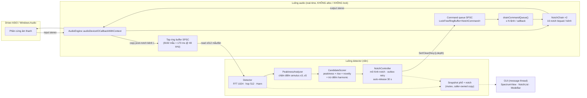
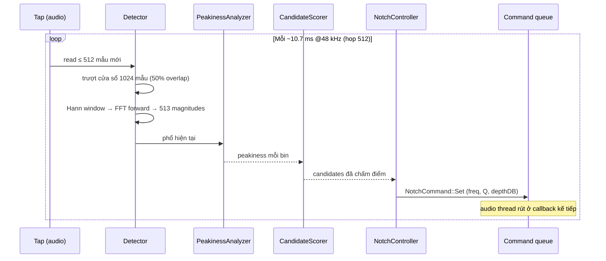
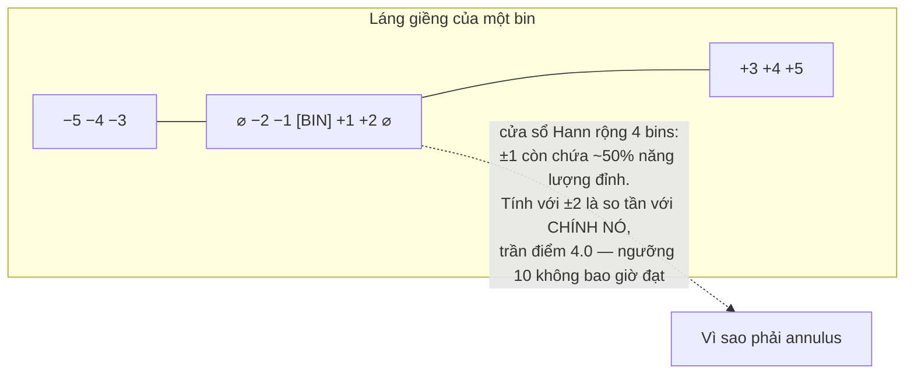

# Kỹ thuật chống hú — AZ Soundtech Hands-free

> Tài liệu mô tả cách hệ thống loại bỏ acoustic feedback, khớp 1:1 với code
> đang chạy (`src/`). Số liệu lấy trực tiếp từ header/khối `constexpr` trong
> source, ngày 23/08/2026. Đọc kèm [`GIOI-THIEU.md`](GIOI-THIEU.md).

## 1. Kiến trúc tổng thể — hai luồng, một đường lock-free

Nguyên tắc nền tảng của real-time audio: **luồng audio không bao giờ được chờ
ai**. Mọi allocation, mutex hay I/O trên luồng đó là một cơn dropout tiềm ẩn.
Vì thế hệ thống tách làm hai luồng, trao đổi nhau qua hai kênh lock-free
(SPSC — single-producer single-consumer), và mọi thứ còn lại dùng mutex thoải mái:



Hai chiều bất đối xứng có chủ đích:

| Chiều | Kênh | Vì sao dạng này |
|---|---|---|
| Audio → Detector | Tap ring buffer (SPSC) | Luồng audio chỉ `write()` và **không bao giờ chờ**; ring đầy thì drop và đếm (`getTapDropCount()`) |
| Detector → Audio | Command queue (SPSC) | Luồng audio rút tối đa `kMaxCommandsPerCallback` lệnh mỗi callback; không rút hết cũng chẳng sao — lệnh còn lại chờ kỳ sau |

Mọi dữ liệu GUI cần (phổ, trạng thái notch) đi qua **snapshot có mutex**: luồng
detector không real-time nên chờ được; caller nhận bản copy của riêng mình nên
không có race.

## 2. Đường tín hiệu audio (chu kỳ vài ms)

1. Driver đưa một block stereo vào callback.
2. **Bypass mode**: copy thẳng in → out. **Auto/Soundcheck**: mỗi mẫu đi qua
   chuỗi 16 biquad notch của kênh nó.
3. Sau khi xử lý, **kênh L sau notch** được copy một lần vào tap ring — detector
   nghe đúng thứ người nghe được, kể cả khi notch đã cắt.
4. Rút command queue (tối đa ~64 lệnh) áp dụng `Set`/`Clear` vào NotchChain.
5. Trả output cho driver. Toàn bộ bước trên: **zero allocation, zero lock**.
   `ScopedNoDenormals` bật ở đầu callback — sau ~4 giây im lặng tuyệt đối,
   chuỗi biquad không có nó sẽ rơi vào limit-cycle denormal và CPU vọt từ
   1.7 ms/s lên 94 ms/s (đã đo, xem ledger CRITICAL 1).

### Bộ lọc notch và độ sâu

Không phải "notch vô hạn" mà là **RBJ peaking-EQ với gain âm**, nên độ sâu là
tham số thật: tại chính tâm tần số, `|H| = 10^(depthDB/20)` theo cấu trúc —
−12 dB nghĩa là còn đúng 0.251 lần biên độ. Ba lớp phòng thủ:

- `depthDB > 0` bị **từ chối ở cả 3 tầng** (PresetManager → NotchChain → Biquad):
  dạng peaking là đối xứng, gain dương sẽ **khuếch đại đúng tần số đang hú** —
  biến phần mềm chống hú thành máy phát hú.
- Tham số không hợp lệ (Q ≤ 0, freq ≥ Nyquist...) bị chặn trước khi chạm hệ số;
  pole ngoài vòng tròn đơn vị đã được đo bùng tới 3.7e77 chỉ sau 208 mẫu.
- Đổi sample rate khiến notch vượt Nyquist mới → notch về trạng thái Idle giữ
  nguyên tham số (**D-00**: hủy kích hoạt, không clamp, không xóa). Clamp là thứ
  từng tạo đỉnh đầu ra 4.11e18.

## 3. Phát hiện hú — từ mẫu đến điểm số



### 3.1 Cửa sổ FFT

- **1024 điểm, hop 512 → overlap 50%**: một tần số không thể "lọt khe" giữa hai
  lần phân tích; sự kiện hú xuất hiện trong nửa chu kỳ phân tích.
- **Cửa sổ Hann**: giảm leakage để một gai hú thật sự là một gai. (Hamming/
  Blackman đều fail test phân biệt — đã kiểm chứng bằng test.)
- **Đồng hồ hai lớp (D-06)**: đồng hồ wall-clock đo thời lượng; cờ
  "tap còn sống" (có mẫu mới trong 250 ms) quyết định khoảng thời gian đó
  **có được tính không**. Mất mic giữa show thì timer đóng băng — không tự nhả
  notch oan, nhưng cũng không đếm "30 giây im" trên audio đã chết. Đồng hồ naive
  "chỉ tăng khi có data" sai vì ~nửa các poll khỏe mạnh là rỗng (5 ms poll vs
  10.67 ms hop).

### 3.2 PeakinessAnalyzer — annulus, không phải lân cận đặc

Một tiếng hú là **một bin nhô cao đứng giữa những bin thấp**. Điểm peakiness:

```
peakiness(bin) = mag[bin] / mean(mag[bin−5 .. bin−3] ∪ mag[bin+3 .. bin+5])
```

Điểm mấu chốt là **vành khuyên (annulus) ±3..±5, loại trừ ±0..±2**:



Lịch sử thật của con số này: spec gốc viết láng giềng ±2 — đo thử, tiếng ồn
trắng đạt tới **3.46** trong khi tone 1 kHz chỉ **3.29**: nhiễu điểm cao hơn
tín hiệu, ngưỡng 10 không bao giờ bắn. Đổi sang annulus ±3..±5: tone 1 kHz =
**131.7**, tệ nhất nhiễu qua 60 seed = **7.35**, zero báo nhầm. Ngưỡng **10.0**
không đổi — cái sai là bán kính, không phải hằng số.

Hệ quả đã ghi nhận: bin thấp nhất chấm điểm được là bin 5 ≈ **234 Hz @ 48 kHz**
(cần 5 bin headroom mỗi bên). Dưới ngưỡng đó detector mù — chấp nhận cho v1,
ghi rõ trong `PeakinessAnalyzer.h`.

### 3.3 CandidateScorer — không phải mọi gai đều đáng khóa

Peakiness chỉ là một nhân tử. Điểm cuối = **peakiness × rise × novelty**, kèm
**phạt harmonic**: nếu tần số F nằm trong dải bội 1.4×–4.1× của một notch đã
khóa thì điểm nhân thêm 0.5. Không có chỗ cho việc cắt bội số của nốt nhạc —
harmonic của keyboard không phải hú.

### 3.4 NotchController — detector là tác giả duy nhất (D-05)

Quyết định kiến trúc quan trọng nhất: **detector là người duy nhất ra lệnh
notch**. Nó không đọc lại trạng thái filter (đọc ngược cross-thread là nơi sinh
race); nó **nhớ những gì mình đã lệnh**. Preset nạp giữa show cũng đi vào qua
detector ("detector nhận nuôi") chứ không ai tự tay đặt vào NotchChain.

Trạng thái mỗi slot mang theo đồng hồ riêng (`locked_at`, `last_detected_at`)
— đây cũng chính là dữ liệu cột "Locked Time" của GUI cần. Lệnh Set/Clear đi
vào outbox có **retry**; audio thread rút ≤ N lệnh/callback nên một đống lệnh
cũng không kéo dài callback.

**Auto-release 30 s** (spec §5.2): quá 30 giây không thấy peakiness ở tần số
đã khóa → phát `Clear`. Filter nhả, quỹ notch quay lại phục vụ ca hú tiếp theo.

### 3.5 Chế độ hoạt động

```mermaid
stateDiagram-v2
    [*] --> Bypass
    Bypass --> Soundcheck : nút Run Soundcheck (15 s)
    Soundcheck --> Auto : hết 15 s
    Bypass --> Auto : nút Auto
    Auto --> Bypass : nút Bypass
    Soundcheck --> Bypass : nút Bypass

    state Bypass {
        note right of Bypass : Copy thẳng in→out.<br/>Tap VẪN chạy — detector vẫn thấy phòng
    }
    state Soundcheck {
        note right of Soundcheck : Khóa mọi đỉnh tìm thấy,<br/>KHÔNG tự nhả
    }
    state Auto {
        note right of Auto : Khóa khi vượt ngưỡng,<br/>tự nhả sau 30 s im
    }
```

Soundcheck dùng cho 15 giây đầu buổi: để phòng "tự khai" — đẩy monitor lên,
bật mic, app khóa sẵn các tần số nguy hiểm trước khi khán giả vào.

## 4. Preset

File JSON `%APPDATA%/AZSoundtech/HandsFree/presets/*.json`: version, device
(chỉ metadata, không bao giờ chặn nạp), sampleRate **số** (không phải chuỗi
"48000 Hz"), bufferSize, danh sách notch đã khóa, và khối tùy chọn
`notchDefaults {Q, depth}` — chỗ duy nhất để Speech (Q=40/−18 dB) và Music
(Q=25/−10 dB) tồn tại, vì preset đóng gói trong installer chưa khóa notch nào
(nốt nào cũng vậy — một default mang notch tần số đoán mò sẽ cắt dB thật trên
mọi PA nó chạm). Hai file mặc định ship kèm, seed vào máy user lúc first-run,
**không bao giờ ghi đè** file đã có.

Loader: lỗi version → từ chối ngay kèm trích version lạ; >16 notch hoặc trùng
index → từ chối (slot đánh địa chỉ theo index, "người sau thắng" nghĩa là
preset tai nghe ≠ preset trong file); notch trên Nyquist của **file** → từ chối
(file tự mâu thuẫn), notch trên Nyquist của **device hiện tại** → nạp bình
thường, đánh dấu AboveNyquist giữ nguyên tham số (D-00).

## 5. Tổng hợp các giới hạn an toàn

| Nguy cơ | Chắn bằng |
|---|---|
| Notch thành máy khuếch đại hú (depth dương) | Từ chối ở PresetManager + NotchChain + Biquad |
| Pole ngoài vòng tròn đơn vị → output bùng | Guard Q/freq/rate ở mọi overload biquad |
| Denormal blow-up sau im lặng dài | `ScopedNoDenormals` đầu callback |
| Allocation/lock trên luồng audio | Zero-alloc theo thiết kế; atomics cho mọi state cross-thread; test ràng buộc |
| Drop tap im lặng biến thành giả broadband | `getTapDropCount()` đếm công khai |
| Timeline discontinuity sau đổi rate | `Detector::reset()` xóa cửa sổ phân tích |
| Notch oan harmonic nhạc | Trừ điểm 1.4×–4.1× của notch đã khóa |
| Race GUI ↔ detector | Snapshot mutex, caller-owned copy |

## 6. Những gì hệ thống cố tình KHÔNG làm (v1)

- **Không adaptive AFC/NLMS** — filter thích ứng liên tục; phạm vi v1 là
  detect-and-notch, đơn giản hơn để tin được trên sân khấu.
- **Không macOS/Linux/plugin** — standalone Windows only.
- **Không cloud sync preset** — local only.
- **Không licensing** (D-07) — freeware; mã license nằm chờ trong repo.
- **Không phủ dưới ~234 Hz** — giới hạn hình học của phép chấm điểm annulus.

## 7. Trạng thái & kiểm chứng (23/08/2026)

- Suite: **244/244 test pass** (ctest Release, MSVC, CI GitHub Actions xanh).
- Mỗi test ghi rõ **thay đổi production nào làm nó đỏ**; nhiều test được xác
  minh bằng mutation thật (sửa production → đỏ đúng test dự đoán → hoàn tác).
- DSP spine (Tasks 12–15), bridge, GUI device/status/mode, presets, installer:
  đã hạ cánh. Còn lại: GUI visualization (19–22, 24), code signing (Task 31,
  chờ EV cert), integration testing với phần cứng thật (Task 32).
