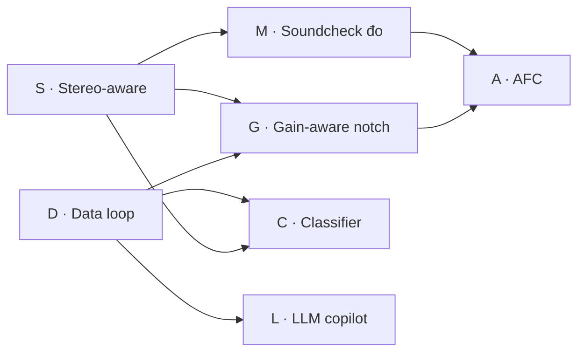

# Roadmap: Anti-feedback v2 — bảy lane, xếp theo phụ thuộc dữ liệu

**Ngày:** 2026-09-04. **Owner quyết:** "làm tất cả" (hội thoại 2026-09-05).
**Nghiên cứu nền:** [`../../research/2026-09-04-anti-feedback-next-gen.md`](../../research/2026-09-04-anti-feedback-next-gen.md).
**Trạng thái:** roadmap đã duyệt hướng; mỗi lane có spec riêng khi đến lượt.

## Nguyên tắc xếp thứ tự

Thứ tự đi theo **cái gì nuôi cái gì**, không theo độ hấp dẫn thương mại:

- Lane nào sinh dữ liệu hoặc phép đo mà lane sau cần thì đi trước.
- Lane không đụng audio path đi trước lane đụng audio path, để mỗi
  release alpha chỉ mang một thay đổi DSP.
- Mỗi lane = một spec + một plan + một worktree + một release alpha.
  Không gộp hai lane vào một release.

## Bảng lane

| # | Lane | Đụng audio path? | Cần gì trước | Spec |
|---|---|---|---|---|
| S | **Stereo-aware detection**: một detector/slot nhìn cả hai làn, notch đặt theo làn, nút LINK | Có (tap làn 1, lệnh mang lane mask) | không | [`2026-09-05-stereo-aware-detection-design.md`](2026-09-05-stereo-aware-detection-design.md) |
| D | **Vòng dữ liệu**: nút oan/đúng trên notch list, log session JSONL (magnitudes quanh sự kiện, không lưu audio) | Không | không | [`2026-09-05-data-loop-design.md`](2026-09-05-data-loop-design.md) |
| G | **Gain-aware notch**: depth theo nhu cầu từ τ ringing, nhả dần thay vì nhả cụt, nối data ring-risk | Có (depth thay đổi theo thời gian) | S (lane), D (đo hiệu quả) | viết khi S+D hạ cánh |
| M | **Soundcheck đo chủ động**: chirp/MLS qua từng output, đo loa→mic, loop gain theo tần số, notch trước khi hú | Có (phát tín hiệu test ra PA) | S (đo per-output = per-lane) | viết khi S hạ cánh |
| C | **Classifier nhỏ** trên detector thread (RTNeural), phân loại hú vs nốt nhạc, feature L/R từ S | Không (chỉ quyết định, không xử lý) | D (nhãn), S (feature) | viết khi D có ≥ vài trăm nhãn từ alpha |
| L | **LLM copilot**: đọc telemetry qua tool call, gợi ý cho soundman | Không | D (telemetry) | viết khi D hạ cánh; chạy song song C |
| A | **AFC**: NLMS + PEM, watchdog + fallback notch | Có, nặng nhất | M (đo loa→mic), G (fallback) | viết cuối cùng |

Tùy chọn không xếp lane riêng, gắn vào lane gần nhất khi có nhu cầu:
frequency shift 3–5 Hz cho mode Speech (gắn G), delay modulation (gắn A).

## Đồ thị phụ thuộc

S và D **song song** được: S đụng `AudioEngine`/`NotchController`/DSP, D
đụng GUI notch list + một logger mới. Điểm chồng duy nhất là
`NotchListPanel` (S thêm cột lane, D thêm nút verdict) và
`MainComponent` ctor. Merge S trước, D rebase.

## Mỗi lane phải đạt

1. Spec trong `docs/superpowers/specs/`, tự review, owner duyệt.
2. Plan từ spec, sub-agent thực hiện từng task, verifier độc lập đọc
   file thật (không đọc báo cáo của agent làm).
3. Build + `ctest` dán output. Lane đụng audio path: nêu **mức thay đổi
   level dự kiến** ngay trong spec.
4. GUI thay đổi: ảnh render từ `HandsFreeSnapshot`, đọc lại ảnh.
5. `docs/GIOI-THIEU.md` + `docs/KY-THUAT-CHONG-HU.md` cập nhật cùng
   commit khi hành vi user-visible đổi.
6. `pwsh -File installer\release-alpha.ps1` đưa build cho tester, note
   gửi tester nêu rõ lane vừa đổi gì.

## Trạng thái

| Lane | Trạng thái | Ngày |
|---|---|---|
| S | **đã làm xong** trên nhánh `claude_desk/feedback-detection-upgrade-102019` (24 commit, suite 397/397, review toàn nhánh sạch); release 1.1.0 alpha; chờ owner merge và nghe thử | 2026-09-05 |
| D | spec đã duyệt phản biện, chờ S merge rồi rebase; kế tiếp | 2026-09-05 |
| G | chờ S, D | |
| M | chờ S | |
| C | chờ D nhãn | |
| L | chờ D | |
| A | chờ M, G | |
