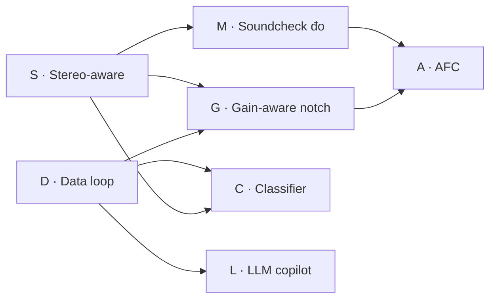

# Roadmap: Anti-feedback v2 — bảy lane, xếp theo phụ thuộc dữ liệu

**Ngày:** 2026-09-04. **Owner quyết:** "làm tất cả" (hội thoại 2026-09-05).
**Nghiên cứu nền:** [`../../research/2026-09-04-anti-feedback-next-gen.md`](../../research/2026-09-04-anti-feedback-next-gen.md).
**Trạng thái:** roadmap đã duyệt hướng; mỗi lane có spec riêng khi đến lượt.

## Nguyên tắc xếp thứ tự

Thứ tự đi theo **cái gì nuôi cái gì**, không theo độ hấp dẫn thương mại:

- Lane nào sinh dữ liệu hoặc phép đo mà lane sau cần thì đi trước.
- Lane không đụng audio path đi trước lane đụng audio path, để mỗi
  release alpha chỉ mang một thay đổi DSP.
- Mỗi lane = một spec + một plan + một worktree + một release alpha.
  Không gộp hai lane vào một release.

## Bảng lane

| # | Lane | Đụng audio path? | Cần gì trước | Spec |
|---|---|---|---|---|
| S | **Stereo-aware detection**: một detector/slot nhìn cả hai làn, notch đặt theo làn, nút LINK | Có (tap làn 1, lệnh mang lane mask) | không | [`2026-09-05-stereo-aware-detection-design.md`](2026-09-05-stereo-aware-detection-design.md) |
| D | **Vòng dữ liệu**: nút oan/đúng trên notch list, log session JSONL (magnitudes quanh sự kiện, không lưu audio) | Không | không | [`2026-09-05-data-loop-design.md`](2026-09-05-data-loop-design.md) |
| G | **Gain-aware notch**: depth theo nhu cầu (đo thực nghiệm, không từ τ), nhả dần thay vì nhả cụt, nối data ring-risk | Có (depth thay đổi theo thời gian) | S (lane), D (đo hiệu quả) | [`2026-09-06-gain-aware-notch-design.md`](2026-09-06-gain-aware-notch-design.md) — **đã hạ cánh 1.2.0** |
| M | **Soundcheck đo chủ động**: chirp/MLS qua từng output, đo loa→mic, loop gain theo tần số, notch trước khi hú | Có (phát tín hiệu test ra PA) | S (đo per-output = per-lane) | S đã hạ cánh → **viết được ngay** (spec `2026-09-06-active-soundcheck-design.md` chưa có; phiên B theo prompt 2026-09-06 chưa chạy) |
| C | **Classifier nhỏ** trên detector thread (RTNeural), phân loại hú vs nốt nhạc, feature L/R từ S | Không (chỉ quyết định, không xử lý) | D (nhãn), S (feature) | viết khi D có ≥ vài trăm nhãn từ alpha |
| L | **LLM copilot**: đọc telemetry qua tool call, gợi ý cho soundman | Không | D (telemetry) | viết khi D hạ cánh; chạy song song C |
| A | **AFC**: NLMS + PEM, watchdog + fallback notch — fallback notch = thang G (đặt −6, đào 6 dB/300 ms, nhả 30 s + 10 s/bậc) | Có, nặng nhất | M (đo loa→mic), G (fallback) | viết cuối cùng |

Tùy chọn không xếp lane riêng, gắn vào lane gần nhất khi có nhu cầu:
frequency shift 3–5 Hz cho mode Speech (gắn G), delay modulation (gắn A).

## Đồ thị phụ thuộc

S và D **song song** được: S đụng `AudioEngine`/`NotchController`/DSP, D
đụng GUI notch list + một logger mới. Điểm chồng duy nhất là
`NotchListPanel` (S thêm cột lane, D thêm nút verdict) và
`MainComponent` ctor. Merge S trước, D rebase.

## Mỗi lane phải đạt

1. Spec trong `docs/superpowers/specs/`, tự review, owner duyệt.
2. Plan từ spec, sub-agent thực hiện từng task, verifier độc lập đọc
   file thật (không đọc báo cáo của agent làm).
3. Build + `ctest` dán output. Lane đụng audio path: nêu **mức thay đổi
   level dự kiến** ngay trong spec.
4. GUI thay đổi: ảnh render từ `HandsFreeSnapshot`, đọc lại ảnh.
5. `docs/GIOI-THIEU.md` + `docs/KY-THUAT-CHONG-HU.md` cập nhật cùng
   commit khi hành vi user-visible đổi.
6. `pwsh -File installer\release-alpha.ps1` đưa build cho tester, note
   gửi tester nêu rõ lane vừa đổi gì.
7. PR lên `origin/main`, CI xanh (dán `gh pr checks`), merge qua PR — không
   merge local vào main. Xem `docs/GIT-WORKFLOW.md`.

## Trạng thái

| Lane | Trạng thái | Ngày |
|---|---|---|
| S | **đã làm xong** trên nhánh `claude_desk/feedback-detection-upgrade-102019` (24 commit, suite 397/397, review toàn nhánh sạch); đã merge main (lane P, 1.0.5) vào nhánh 2026-09-05, `savePreset` ghi notch theo làn + `linked`; release 1.1.1 alpha (1.1.0 là bản nhánh chưa gộp, bỏ); **đã merge main** (trước lane R, main `d58eac0`→`6b8d084` 06/09/2026); 1.1.3 alpha mang S+D+R | 2026-09-05 |
| D | **đã làm xong** trên nhánh `feat/data-loop` (8 task + fix wave sau verifier độc lập & review toàn nhánh, suite 432/432); **release 1.1.2 alpha đã đẩy** lên `Z:\My Drive\RELEASE\ALPHA TEST` (gate 432/432, SHA-256 `51E28F8EDD6E…`); **đã merge main** `e9da9c6` (owner, 05/09/2026 chiều) | 2026-09-05 |
| G | **đã merge main `68dd7ef`** (owner "merge master local" 07/09/2026), **đã đóng gói 1.2.0 alpha** (gate 547/547, SHA-256 `F701FFFC…`, `Z:\My Drive\RELEASE\ALPHA TEST`, chưa ai nghe trên rig) — nhánh `claude_desk/lane-g-brainstorm-sdd-f3c568`, 40 commit, 10 task SDD + fix rounds, final review 0 finding mở: thang độ sâu theo nhu cầu (đặt −6/−12, đào 6 dB mỗi 300 ms, trần = slider), nhả dần 30 s + 10 s/bậc, đóng băng nhả khi RING RISK ≥ RISING (slot-global, không trần thời gian), nhớ phòng 5 phút, ramp độ sâu 10 ms trong `Biquad`, `notch_retune` trong log session, `preset_load` đọc/ghi trần (Q11, `ceiling_applied`) | 2026-09-07 |
| M | **mở** — S đã hạ cánh; chưa có spec, chưa có nhánh. Bước kế theo roadmap (A cần M) | 2026-09-07 |
| C | chờ D nhãn: mở khi có ≥ 300 verdict từ ≥ 3 session | |
| L | chờ D | |
| A | chờ M (G đã merge: fallback notch dùng thang G) | 2026-09-07 |

**Quyết định điều phối viên (Task 3, lane D, 2026-09-05):** amendment A-9 của
plan lane D — "reset Detector của lane 1 khi một slot widen 1→2" — bị **rút
khỏi lane D khi review**. Reset chỉ Detector mà không đụng lịch sử của
`CandidateScorer` để lại history cũ, khiến hai trục rise/novelty bị bão hòa về
0 trong ~200 ms trên làn vừa quay lại — **dễ dãi hơn** hành vi 1.1.1 đang
chạy, không phải chặt hơn. Việc có nên chặn `riseReferenceMs` cho làn tái nhập
sau khi widen hay không là **quyết định owner còn treo cho lane S**. Chi tiết:
`.superpowers/sdd/2026-09-05-data-loop/progress.md`, mục "Task 3: CONTROLLER
RULING".
